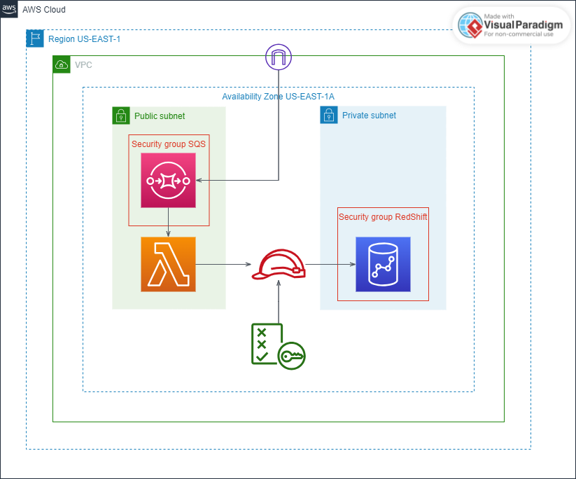

     
    </a>
  <h3>
    <strong>Challenge DevSecOps</strong>
  </h3>

## 🚀 Contribuir

### **Getting Started**

1.Choose a Cloud Provider and connect using the CLI.
2.Deploy Infraestructure - DEV
3.Producer and Consumer with Lambda
4.Add Security
5.Using cloudwatch to metrics